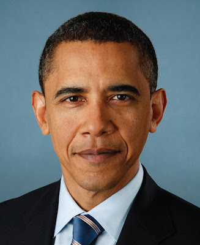
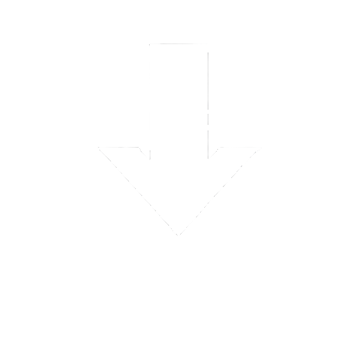
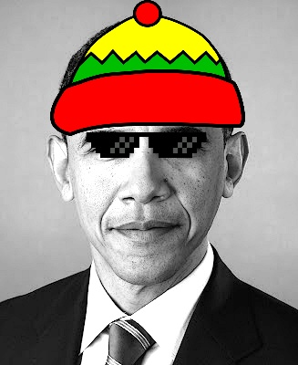

# Meme Generation App

An application in Python for portrait editing and meme creation. This application allows users to upload portrait images in various formats (png/jpeg/tiff) and customize them with a diverse set of filters for meme creation.

## Table of Contents

- [Features](#features)
  - [Portrait Image Support](#portrait-image-support)
  - [User-Friendly Interface](#user-friendly-interface)
  - [Save and Clear Canvas](#save-and-clear-canvas)
- [Available Filters and Algorithms](#available-filters-and-algorithms)
- [How It Works](#how-it-works)
- [Running the Notebook](#running-the-notebook)
  - [Dependencies](#dependencies)
- [Meme Examples](#meme-examples)

## Features

### Portrait Image Support

- Accepts portrait images in formats like png/jpeg/tiff, providing versatility for user uploads.

### User-Friendly Interface

- A user-friendly interface allows easy selection of filters for meme customization.

### Save and Clear Canvas

- Option to save the edited meme in jpeg format.
- Clear canvas feature for experimenting with different filters and algorithms.

## Available Filters and Algorithms

1. **Gaussian Blur Filter:**
   - Blurs the image using a Gaussian filter for softening.
   
2. **Laplacian Filter:**
   - Highlights edges in the image by applying a Laplacian filter, useful for enhancing details.
   
3. **Color Boosting:**
   - Enhances the colors in the image, making it appear more vibrant and dynamic.
   
4. **Sharpening Filter:**
   - Sharpens the image, bringing out fine details for a clearer and more defined look.
   
5. **Sepia Filter:**
   - Adds a sepia tone to the image, giving it a vintage or old-time feel.
   
6. **Box Blur Filter:**
   - Applies a box blur to soften the image, creating a smoother and diffused look.
   
7. **Face Detection:**
   - Detects faces in the image, enabling further editing like meme placement on detected faces.
   
8. **Meme Placement (Mask/Hat):**
   - Places a fun meme asset (like a mask or hat) from the `meme_assets` folder onto detected faces.
   
9. **Eyes Detection:**
   - Detects eyes in the image, allowing for specialized meme editing such as adding eye-related accessories.
   
10. **Meme Placement (Eye Mask/Glasses):**
    - Places accessories like an eye mask or glasses from the `meme_assets` folder onto detected eyes.

## How It Works

1. Upload a portrait image.
2. Select from a variety of filters and algorithms for customization.
3. Save the edited meme in jpeg format or clear the canvas for additional edits.

## Running the Notebook

To run the `Project.ipynb` notebook, ensure you have Python installed. Then, follow these steps:

1. Clone or download the project.
2. Open the `Project.ipynb` file in Jupyter Notebook or any compatible Python environment.

### Dependencies

Install the following Python libraries to run the project:

- [NumPy](https://numpy.org/)
- [Matplotlib](https://matplotlib.org/)
- [Imageio](https://imageio.readthedocs.io/)
- [OpenCV (cv2)](https://opencv.org/)

You can install these dependencies using the following command and run the app:

```
pip install numpy matplotlib imageio opencv-python
jupyter notebook Project.ipynb
```

## Meme Examples

Here are some examples of memes created using the app:

1. **Meme with hat and glasses:**
 
   Original Image:  
   <div style="text-align: center; padding-top: 10;">
     
   </div>

   <div style="position: relative; display: inline-block; margin-left: 200px;">
     
   </div>

   Meme Image:
   <div style="text-align: center; padding-top: 10">
     
   </div>

3. **Meme with Mask:**

   Original Image:  
   

   <div style="text-align: center; font-size: 48px;">
   ⬇️
   </div> 

   Meme with Mask:  
   

4. **Meme with Hat and Glasses:**

   Original Image:  
   

   <div style="text-align: center; font-size: 100px;">
   ⬇️
   </div> 

   Meme with Hat and Glasses:  
   

5. **Sharpened Portrait with Hat:**

   Original Image:  
   

   <div style="text-align: center; font-size: 100px;">
   ⬇️
   </div>  

   Sharpened Portrait with Hat:  
   
